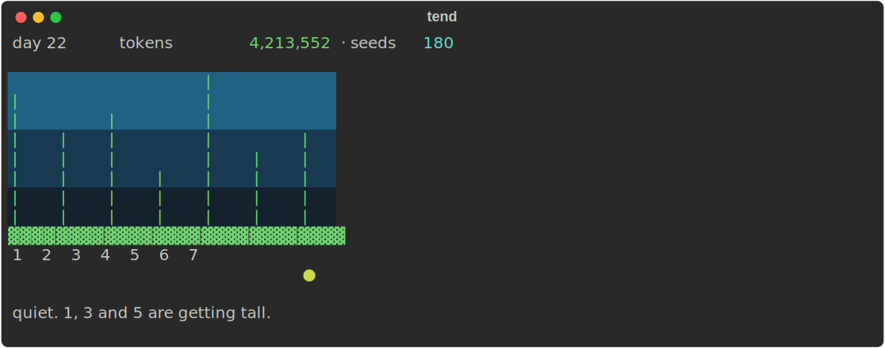
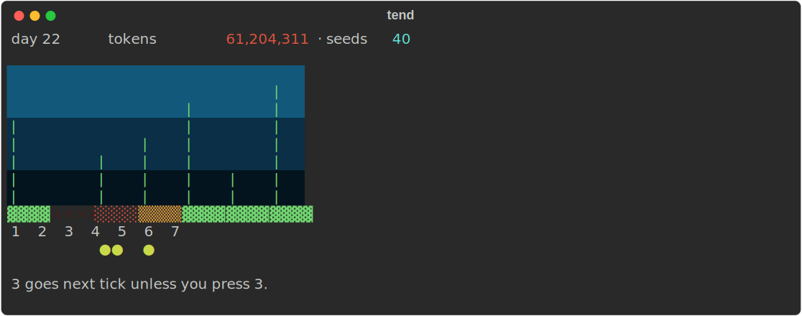

# tend

[](LICENSE)


A small terminal toy that grows out of a Claude Code session's own token
usage. No score, no achievements, nothing it's trying to get you to do —
just something to glance at.

## Preview



Same picture, worse day — one washed out, one dying, one under attack:



Both are real output — `tend`'s own renderer, captured straight to SVG
(`assets/generate.py`), not mockups.

## Install

```bash
pip install -e .
```

Requires Python 3.11+. Installs the `tend` command on PATH.

## Set up

Two pieces, both point at this repo's absolute path:

1. **The Stop hook** — grows the world. In Claude Code's settings
   (`~/.claude/settings.json`), add:

   ```json
   "hooks": {
     "Stop": [
       { "hooks": [ { "type": "command", "command": "/absolute/path/to/tend/hooks/stop_hook.sh" } ] }
     ]
   }
   ```

2. **The `/tend` skill** — draws the world. Symlink or copy `skill/` into
   Claude Code's skills directory:

   ```bash
   ln -s /absolute/path/to/tend/skill ~/.claude/skills/tend
   ```

That's it. The hook fires after every agent turn from then on; type `/tend`
any time to check in.

## How it works

### 1. The loop

Every time Claude Code finishes a turn, the Stop hook runs `tend tick`,
which:

1. Reads however much of the session transcript is new since the last tick
   (transcripts are append-only JSONL; `tend` just tracks a byte offset).
2. Sums that delta's token usage into four buckets: `input`, `output`,
   `cache_read`, `cache_write`.
3. Feeds those buckets through the engine (below) to grow, chew, kill, and
   revive seven stalks.
4. Saves the result and rings the terminal bell.

The hook always backgrounds the call and always exits `0` — a broken toy
must never break the agent's turn.

`/tend` never ticks. It only ever reads what the hook already wrote and,
optionally, clears one stalk. If both could advance the world, the "game"
would just become something to click for its own sake, which defeats the
point — the world only ever grows from real work happening.

### 2. Token mapping

Each token class drives exactly one mechanic:

| Token class | Effect |
|---|---|
| `output` | Growth — taller stalks |
| `cache_write` | Urchin spawn — new stalks come under attack |
| `cache_read` | Seeds — currency for reviving a dead stalk |
| `input` | Shade — halves growth above a threshold |

### 3. Tuning constants

Everything below lives in `src/tend/engine.py`, in one block, specifically
so it's easy to retune by feel:

| Constant | Value | Meaning |
|---|---|---|
| `TOKENS_PER_SEGMENT` | 20,000 | output tokens for one segment of growth |
| `TOKENS_PER_URCHIN` | 15,000 | cache-write tokens per urchin spawned |
| `TOKENS_PER_SEED` | 10,000 | cache-read tokens per seed |
| `REVIVAL_COST` | 100 | seeds to bring a dead stalk back |
| `SHADE_THRESHOLD` | 150,000 | input tokens above which growth halves |
| `MAX_HEIGHT` | 8 | cap on a single stalk's height |
| `STALK_COUNT` | 7 | fixed everywhere — `state.py`, `render.py`, `message.py` all agree |

### 4. One tick, in order

`engine.tick()` runs these eight steps in this exact order every time —
the order is load-bearing (e.g. seeds have to accrue before revival checks
them):

1. **Accrue** — add the full delta to cumulative spend. Monotonic; never
   decreases, never resets.
2. **Grow** — `output // TOKENS_PER_SEGMENT` segments, distributed one at a
   time across living (non-dead) stalks, halved if `input` exceeded the
   shade threshold. Capped at `MAX_HEIGHT`.
3. **Seed** — `cache_read // TOKENS_PER_SEED` added to the seed bank.
4. **Spawn** — `cache_write // TOKENS_PER_URCHIN` urchins land on living
   stalks, weighted toward taller ones.
5. **Chew** — every stalk carrying at least one urchin advances one base
   state: healthy → chewed → dying → dead. Urchins aren't cleared by this —
   only a squish clears them.
6. **Die** — any stalk that just reached `dead` loses its height.
7. **Revive** — for each dead stalk, if there are enough seeds, spend them
   and bring it back at `healthy`, height 1, no urchins.
8. **Advance** — the day counter ticks forward, and a `quiet_ticks` counter
   increments if literally nothing happened this tick (no growth, no spawn,
   no chew) — this is what eventually produces the "quiet" message below,
   and it's the only place idle time is tracked at all.

Squishing a stalk (`tend squish N`, or pressing 1–7 in `tend draw`) just
clears its urchins. It's free, doesn't advance anything else, and is the
only player action that exists.

### 5. The message line

One line, worst-condition-first. `message.py` checks these in order and
returns on the first match:

| Priority | Condition | Example |
|---|---|---|
| 1 | A stalk died, no seeds to revive it | `5 washed out. no seeds left. it stays gone.` |
| 2 | A stalk died, seeds spent reviving it | `5 washed out. seeds -100. 2 is next.` |
| 3 | A stalk is dying *and still has urchins on it* | `4 goes next tick unless you press 4.` |
| 4 | 3+ urchins landed this tick | `five urchins landed at once. 4, 5, 6. pick one.` |
| 5 | 2+ stalks chewed this tick | `2 and 6 both chewed. 6 is worse.` |
| 6 | 1 stalk chewed this tick | `2 is being chewed. press 2.` |
| 7 | 5+ ticks with no activity | `quiet. nothing's happened in a while.` |
| 8 | A stalk is dying but has no urchins (stable) | `quiet. 3 is still fragile.` |
| 9 | Default — some stalks are just tall | `quiet. 3 and 6 are getting tall.` |

Priority 3 only fires when the dying stalk still has a live urchin on it —
"goes next tick" is a claim about what happens *next*, and it's only true
if something is actually still chewing. A dying stalk with nothing on it
isn't going anywhere on its own; it just sits at priority 8 until something
lands on it again or it gets revived.

### 6. The streak is cosmetic, on purpose

Clearing a stalk that had urchins on it increments a streak; any tick
without a squish decrements it. The streak's *only* effect is brightening
the water gradient across four tiers (`STREAK_TIERS = [3, 6, 10]` in
`feel.py`) — it never touches growth, spawn rate, seed accrual, chew speed,
or revival cost. This is enforced, not just documented: `engine.py` never
imports `feel` and never references `streak` at all — there's a test that
asserts identical tick output at streak 0 and streak 12. A streak that
rewarded attention would punish walking away, which would work against the
one thing this toy is actually for.

### 7. Two ways to look at it

`tend draw` is the original design: print a frame, block for a single raw
keypress, print the result, exit. It works great — but only from a real
terminal. Claude Code's tool calls never get a live TTY (confirmed the hard
way: `tend draw` run via an assistant's Bash call crashes on
`termios.tcgetattr`), so an agent running it on your behalf can show you
the picture but can never actually receive your keypress.

So there's a second, deliberately non-interactive path for that case:

- `tend status` — read-only, no keypress, no state change. Prints the same
  picture.
- `tend squish N` — clears stalk `N`, no keypress required.

The `/tend` skill uses `status` + `squish`; it never touches `draw`. If
you're at a real terminal, `tend draw` still works exactly as designed.

### 8. Status, history, and what's never shown

```bash
tend status         # the picture, read-only
tend status --json  # the same state, plus lifetime history, as JSON
```

The JSON form includes a `history` object — total ticks, squishes, deaths,
revivals, urchins spawned, the longest quiet and squish streaks, and the
biggest single die-off — persisted separately in `~/.tend/history.json`.
It's there for whoever wants to look at trends across sessions. It never
appears in the rendered picture: no rank, no ladder, no number in the
corner besides the spend count itself.

## Commands

| Command | What it does |
|---|---|
| `tend tick --transcript PATH` | Advance the world from a transcript delta. Driven by the Stop hook; not meant to be run by hand. |
| `tend draw` | Interactive: print, wait for one keypress (1–7 squishes, anything else exits), print again. Real terminal only. |
| `tend squish N` | Clear stalk `N` (1–7), non-interactively. |
| `tend status [--json]` | Read-only peek at the current picture, or the full state + history as JSON. |

## Development

```bash
pip install -e ".[dev]"
pytest
```

`assets/generate.py` regenerates the two screenshots above from the real
`render.py`/`state.py` code whenever the look of the game changes — it's a
repo-maintenance script, not part of the package or its tests.

There's no live spec document — the original build plan was a starting
point, not a contract, and everything since has been driven by actually
using the thing and fixing what didn't hold up. `git log` and the source
are the current truth.
